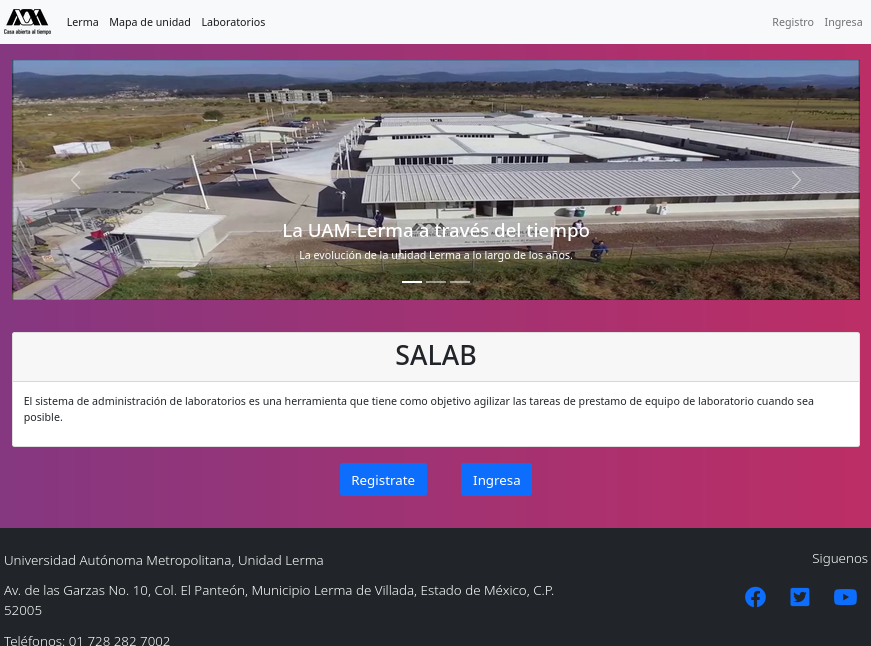
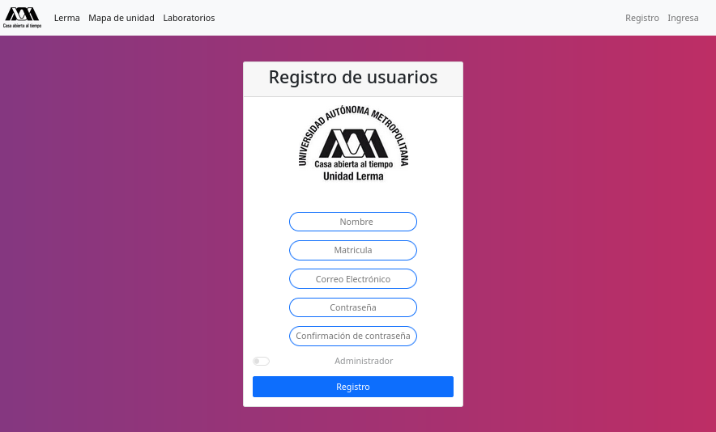
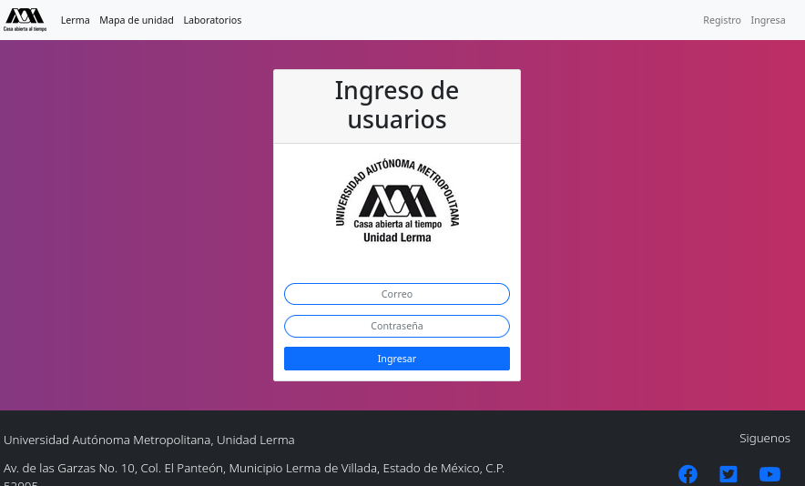
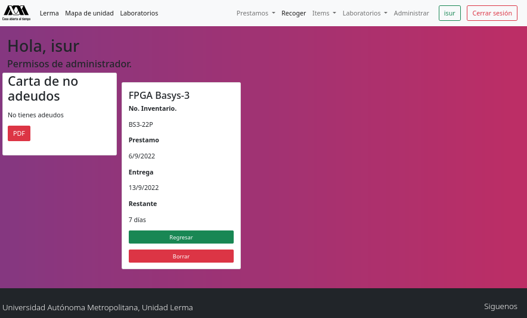
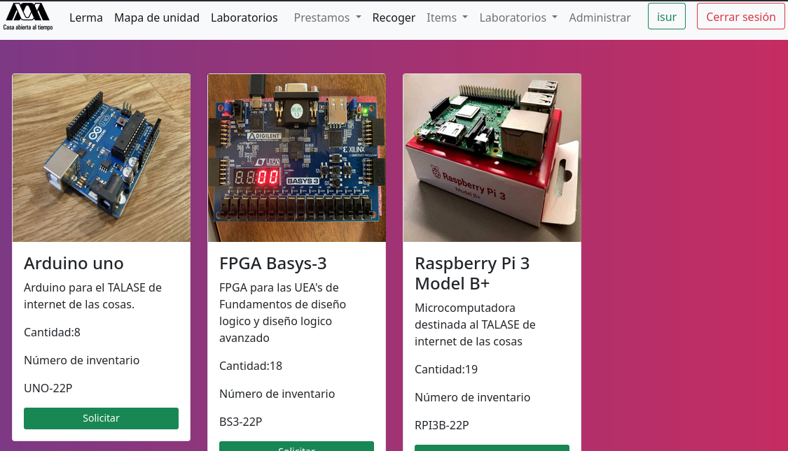
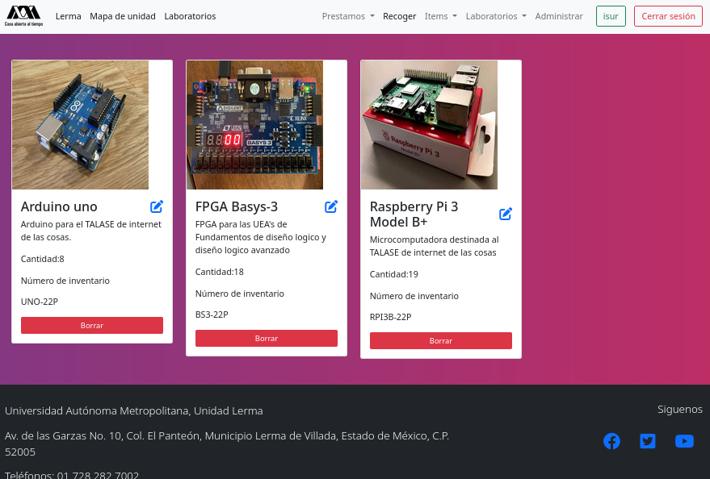
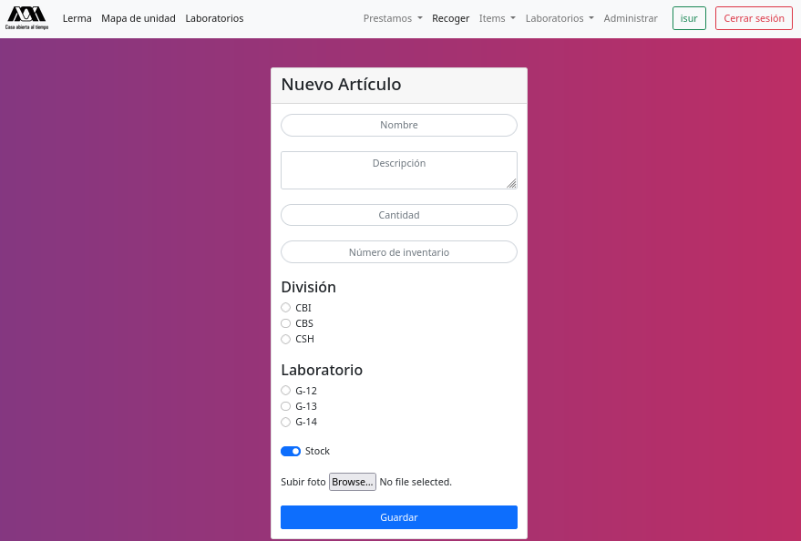
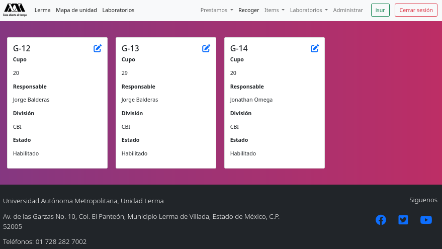
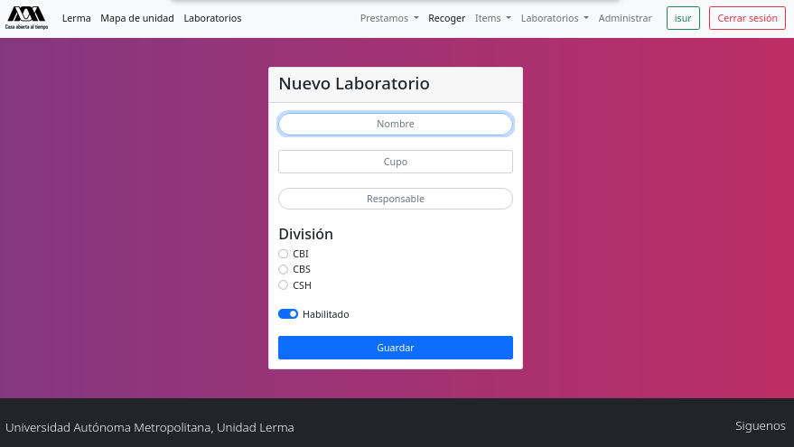
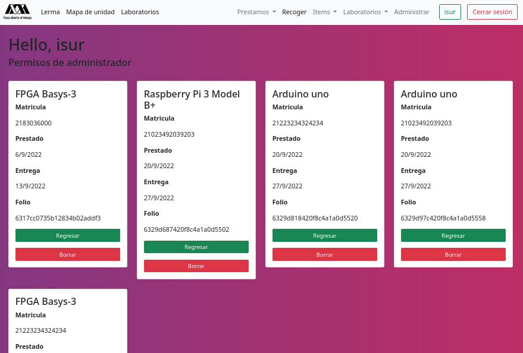

# SALAB-UAM
Sistema de administración de laboratorios para la UAM Lerma.
## ¿Qué es?
SALAB es un sistema de administración para laboratorios enfocado a universidades, en este caso, la UAM Lerma.

## Tecnologías usadas
- Node JS (Backend)
- MongoDB (Base de datos)
- Javascript (Backend)
- HTML (Frontend)
- CSS (Frontend)
- Handlebars (Frontend)
## Modulos usados
- Express JS
- Connect-flash
- Passport
## Bienvenida
Es la pantalla que se verá al ingresar a la página, en la cual tendremos que elegir entre iniciar sesión o registrar un usuario.

También nos muestra información relevante sobre la unidad y los datos de contacto de la institución.

## Registro de usuarios
El registro de usuarios fue diseñado con ayuda de handlebars, html y css.

Aquí los usuarios pueden ingresar sus datos de contacto y crear una contraseña para acceder al servicio.
## Inicio de sesión
Las credenciales creadas en la sección anterior se pueden depositar aquí, especifícamente el correo y la contraseña previamente registrada.

## Prestamos
Al iniciar sesión, el usuario será reedirigido a la pestaña de prestamos donde si no ha solicitado alguno, se le invitará a hacerlo. De lo contrario nos mostrará los prestamos activos, y en dado caso que el usuario sea un usuario con permisos de administrador, tendrá algunas opciones extra para mantener el control de préstamos.

También será posible imprimir una carte de no adeudos auto generada.
## Nuevo préstamo.
El usuario podrá solicitar alguno de los artículos ofertados por los laboratorios.

Tendrá 7 días para devolver el artículo aunque este plazo es configurable de acuerdo a las necesidades de los laboratorios.
# Artículos
En esta pestaña los usuarios administradores pueden agregar artículos, editarlos o borrarlos.

## Nuevo artículo
En esta pestaña el administrador podrá agregar los datos de especificación para un nuevo artículo disponible a préstamo, datos tales como la división o el laboratorio al que pertecen así como una imagen descriptiva de los artículos.

## Laboratorios
En esta pestaña podemos visualizar los laboratorios existentes, en caso de ser un administrador podremos borrarlos o editarlos.

## Nuevo laboratorio
El administrador puede definir un nuevo laboratorio, agregando datos como el encargado, el cupo o a que división corresponde.

## Administrar
La pestaña más útil para un administrador. Aquí podrá visualizar todos los préstamos activos, cuando se tienen que devolver y quién los ha solicitado. Un control total sobre la situación de los préstamos.
# R-SIGECA
